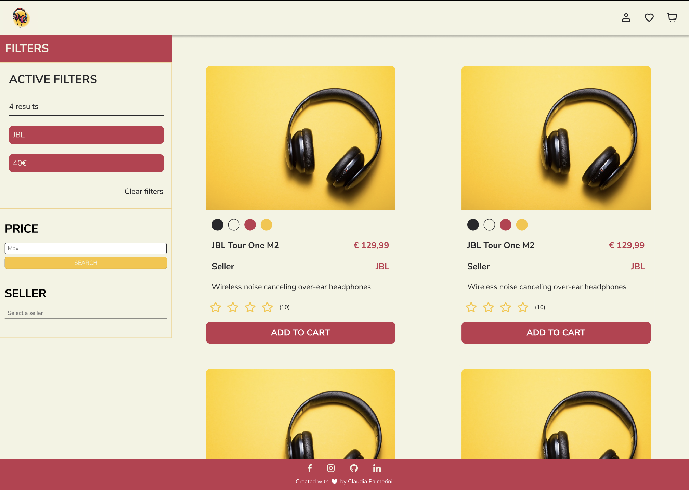
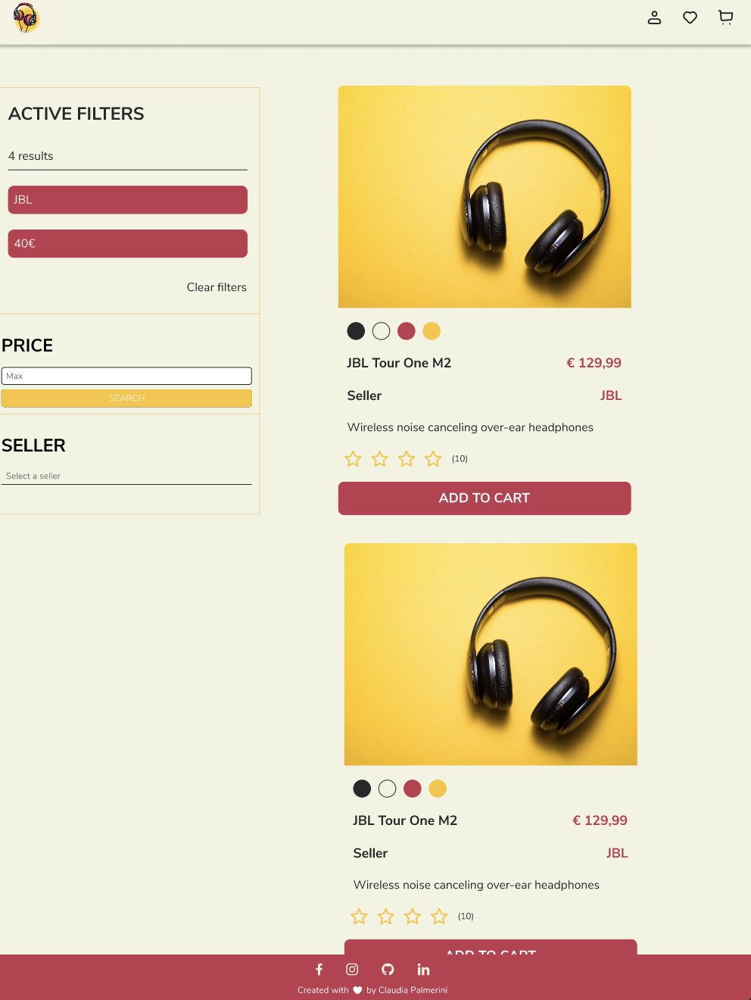
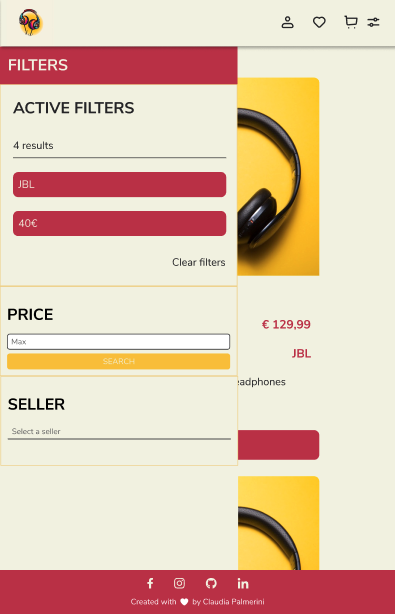

# Project 2 - HTML, CSS & JS

## Acceptance criteria

### JS

- [x] The HTML of the website is dynamically generated using template tags defined in JavaScript. Two base sections, .filter and .products, are allowed for introducing elements with JavaScript for the DOM.

- [x] The list of products will be traversed, and a product card will be dynamically created for each element using a for loop or .forEach.

- [x] At least two filters for the products will be defined on the left side of the document: 

- [x] The first filter will be a select element that displays all distinct sellers in the project's products. When clicked, it will cause the document to display only the elements with the same value in the seller property. At least 4 distinct sellers will be defined in the products of the products object.

- [x] The second filter will be a number input accompanied by a button with the text "Search." The user can enter an amount of money in the filter and click search, causing only elements with a price (price) lower than this amount to appear on the screen.

- [x] There will be a "Clear Filters" button that, when clicked, will repaint all products on the screen without applying any filters.

### HTML & CSS

- [x] The HTML code is correctly structured. There are two main section or article elements representing the search filters (on the left on desktop, above the content on mobile) and the items for sale in the store (on the right on desktop, below the filters on mobile).

- [x] The items for sale in the store share the same CSS class, defining a product card with some hover effect when the mouse is over them.

- [x] The website has media queries for desktop and mobile, as well as a correct structure and positioning of elements using flex or grid.

- [x] The products have correct images that are visible in the component card for each one.

## Implementation:

- The project is a simple product list ( headphones ) with filter functionality
- I use the desktop first approach
- I use holy grail `grid` layout for the main structure: with an header, aside with filter section, main content and footer
- The web site is fully responsive
- For the mobile, the aside is hidden and there is a filter button on the top right to show the filter section from the left side
- The project has the functionality of multiple filters, by price, by seller
- There is a clear filter button to clear all the filters that were applied
- I add a section called "active filter" to show the applied filter and the number of the products available with these filters
- I add some animation when hovering on the links in the navbar and the image when hovering on one of the cards
- I use the following breakpoints
  - Desktop: 1440px
  - Tablet: 950px
  - Mobile: 750px

## Figma design:

### Desktop

### Tablet

### Mobile

